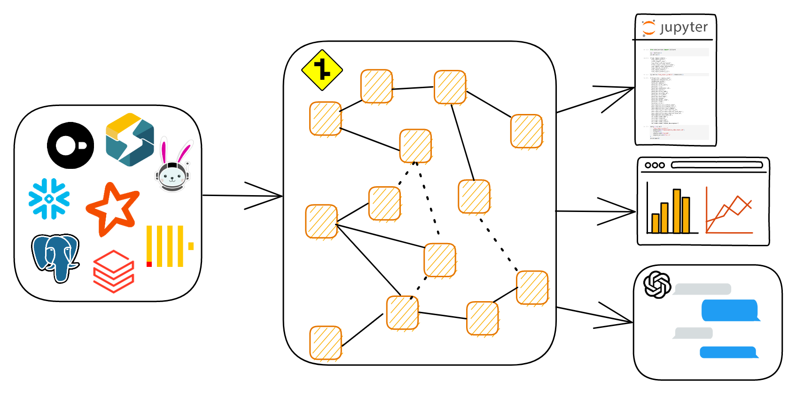

# DataJunction

## Introduction

DataJunction (DJ) is an open source **metrics platform** that allows users to define
metrics and the data models behind them using **SQL**, serving as a **semantic layer**
on top of a physical data warehouse. By leveraging this metadata, DJ can enable efficient
retrieval of metrics data across different dimensions and filters.

## How does this work?

At its core, DJ stores metrics and their upstream abstractions as interconnected nodes.
These nodes can represent a variety of elements, such as tables in a data warehouse
(**source nodes**), SQL transformation logic (**transform nodes**), dimensions logic,
metrics logic, and even selections of metrics, dimensions, and filters (**cube nodes**).

By parsing each node's SQL into an AST and through dimensional links between columns,
DJ can infer a graph of dependencies between nodes, which allows it to find the
appropriate join paths between nodes to generate queries for metrics.

## Getting started

While all the functionality above currently works, DJ is still not ready for production use. Only a very small number of functions are supported, and we are still working towards a 0.1 release. If you are interested in helping take a look at the `issues marked with the "good first issue" label <https://github.com/DataJunction/dj/issues?q=is%3Aissue+is%3Aopen+label%3A%22good+first+issue%22>`_.
