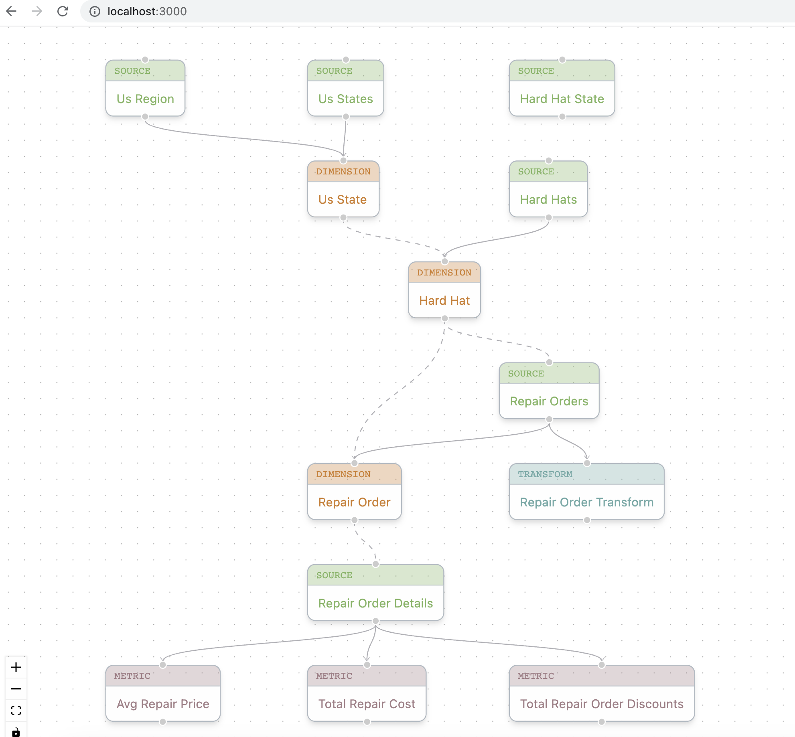

# DJ DAG UI

This shows a read-only view into the DJ nodes DAG.



## Running Locally

### `docker compose`

One option for running locally is to go to the `dj-demo` root directory and run
`docker compose up`. This will bring up all services (DJ core, DJ query service, 
DJ reflection service, and this UI). The UI is available at [http://localhost:3000](http://localhost:3000).

### `npm start`

The second option is to start up the app with:
```
npm start
```
The app will be available in development mode at [http://localhost:3000](http://localhost:3000), but
you'll need to run the DJ core service separately to view the actual DJ DAG.
The page will reload when you make changes and you'll see any lint errors in the console.

### `npm test`

Launches the test runner in the interactive watch mode.\
See the section about [running tests](https://facebook.github.io/create-react-app/docs/running-tests) 
for more information.

### `npm run build`

Builds the app for production to the `build` folder.\
It correctly bundles React in production mode and optimizes the build for the best performance.

The build is minified and the filenames include the hashes.\
Your app is ready to be deployed!
